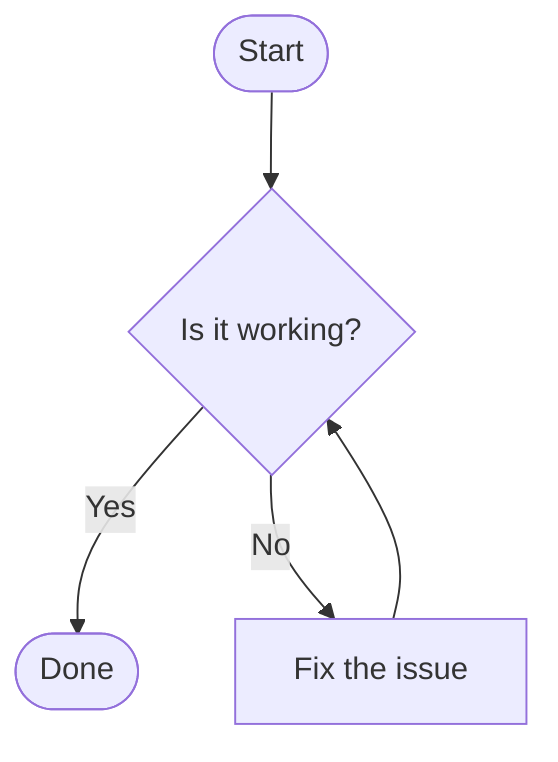
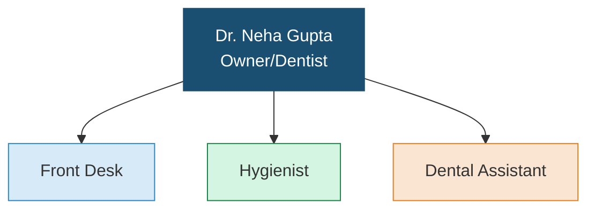
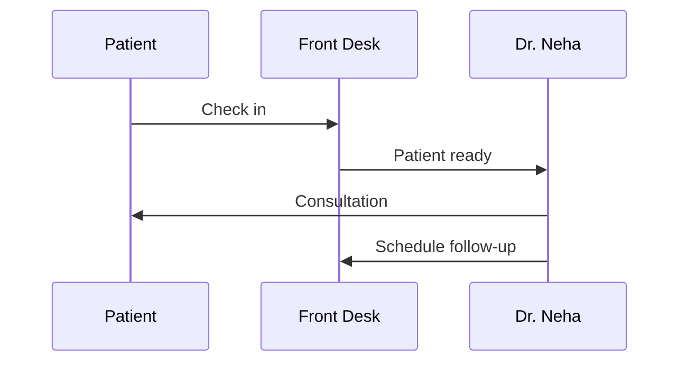
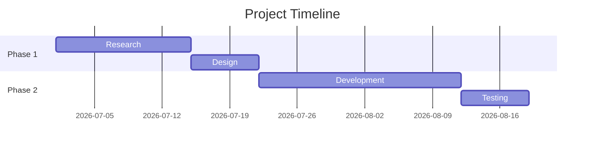
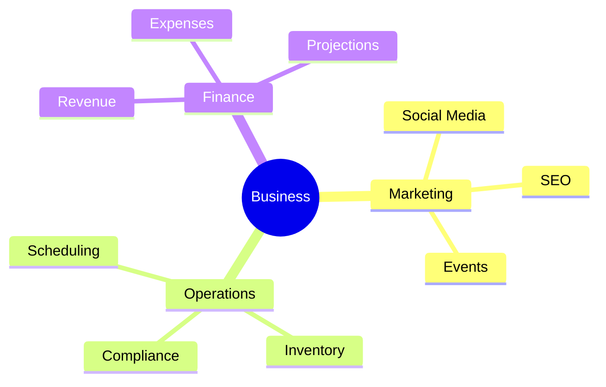
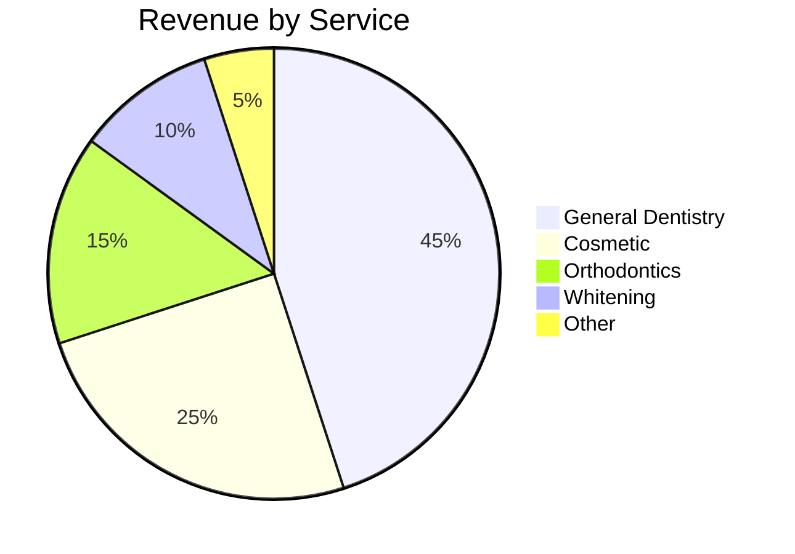
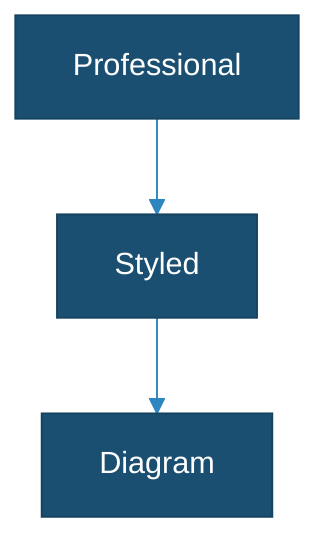

# Visual Creation

## Decision Matrix

| Need | Tool | Why |
|------|------|-----|
| Org chart, flowchart, sequence diagram | Mermaid CLI (`mmdc`) | Automatic layout, professional styling |
| Gantt chart, timeline, mindmap | Mermaid CLI | Built-in chart types |
| Simple pie/bar chart | Mermaid CLI | Quick, no JS needed |
| Floor plan, evacuation map, spatial layout | HTML/CSS + agent-browser screenshot | Precise spatial control with CSS Grid |
| Marketing graphic, social post, promotional material | `generate_image` MCP tool | Local AI (Flux model), free, 30-90s |
| Photorealistic image, artistic visual | `generate_image` MCP tool | Local AI generation, free |
| Complex data visualization | HTML + D3.js/Chart.js + agent-browser screenshot | Interactive-quality rendered static |
| Image with text overlay, collage | Sharp compositing (Node.js script) | Programmatic image manipulation |
| Presentation with charts | pptxgenjs (office-docs skill) | Native PowerPoint |

## Tool 1: Mermaid CLI (Structured Diagrams)

Mermaid converts text syntax into professional diagrams. The rendering engine handles layout, proportions, and styling automatically.

### How to Use

1. Write diagram syntax to a `.mmd` file
2. Run `mmdc` to render PNG or SVG
3. Send via `mcp__nanoclaw__send_file`

```bash
# Write diagram
cat > /tmp/diagram.mmd << 'EOF'
graph TD
    A[CEO] --> B[VP Sales]
    A --> C[VP Operations]
    B --> D[Sales Manager]
    C --> E[Office Manager]
EOF

# Render to PNG (high resolution)
mmdc -i /tmp/diagram.mmd -o /workspace/group/files/org-chart.png -w 1920 -H 1080 --backgroundColor white

# Or render to SVG (scalable)
mmdc -i /tmp/diagram.mmd -o /workspace/group/files/org-chart.svg
```

### Diagram Types

**Flowchart:**


**Org Chart (use graph TD):**


**Sequence Diagram:**


**Gantt Chart:**


**Mindmap:**


**Pie Chart:**


### Theming

Use `%%{init: {...}}%%` at the top of the diagram for custom styling:



## Tool 2: AI Image Generation (`generate_image`)

Use the `generate_image` MCP tool for creative/artistic visuals. This runs locally on the host using the Flux AI model via Draw Things CLI. Completely free, no API costs.

### Performance

- 1024x1024: ~30-60 seconds
- 1024x1792 or 1792x1024: ~60-90 seconds
- Runs locally on Apple Silicon GPU — no internet needed

### Usage

```
generate_image(
  prompt: "Detailed description of the image...",
  size: "1024x1024",      // square
  quality: "high",
  output_filename: "css-whitening-promo.png"
)
```

### Prompt Engineering Tips

Be extremely specific. Bad prompts produce bad images.

**Bad:** "dental office social media post"
**Good:** "A warm, inviting photograph of a modern dental office reception area with natural wood accents, soft ambient lighting, and green plants. Clean white walls, comfortable seating, and a welcoming reception desk. Professional but homey atmosphere. No text overlay. Shot from slightly above eye level with shallow depth of field."

**For marketing materials:**
- Specify brand colors (CSS uses navy #1B4F72 and light blue #D6EAF8)
- Specify dimensions for the target platform
- Describe the mood, lighting, and composition
- Say "no text" if you'll add text with Sharp later

**Size guide by platform:**
- Instagram post: 1024x1024 (square)
- Instagram story/reel: 1024x1792 (portrait)
- Facebook/LinkedIn: 1792x1024 (landscape)
- Twitter/X header: 1792x1024 (landscape)

## Tool 3: HTML/CSS + Screenshot (Custom Layouts)

For floor plans, dashboards, and anything needing precise spatial control, create an HTML file and screenshot it with agent-browser.

### How to Use

1. Write HTML/CSS to `/tmp/layout.html`
2. Open with agent-browser: `agent-browser open file:///tmp/layout.html`
3. Screenshot: `agent-browser screenshot /workspace/group/files/output.png --full`
4. Close: `agent-browser close`

### Floor Plan Template

```html
<!DOCTYPE html>
<html>
<head>
<style>
  * { margin: 0; padding: 0; box-sizing: border-box; }
  body { font-family: Arial, sans-serif; background: white; padding: 40px; }
  h1 { text-align: center; color: #1B4F72; margin-bottom: 20px; font-size: 24px; }
  .floor-plan {
    display: grid;
    grid-template-columns: repeat(12, 1fr);
    grid-template-rows: repeat(8, 80px);
    gap: 2px;
    border: 3px solid #1B4F72;
    max-width: 960px;
    margin: 0 auto;
    background: #ddd;
  }
  .room {
    background: white;
    display: flex;
    flex-direction: column;
    align-items: center;
    justify-content: center;
    font-size: 12px;
    font-weight: bold;
    color: #333;
    border: 1px solid #ccc;
    padding: 4px;
    text-align: center;
  }
  .room .dims { font-size: 10px; color: #666; font-weight: normal; margin-top: 4px; }
  .reception { grid-column: 1/7; grid-row: 1/3; background: #D6EAF8; }
  .waiting { grid-column: 7/13; grid-row: 1/3; background: #EBF5FB; }
  .op1 { grid-column: 1/5; grid-row: 3/6; background: #D5F5E3; }
  .op2 { grid-column: 5/9; grid-row: 3/6; background: #D5F5E3; }
  .op3 { grid-column: 9/13; grid-row: 3/6; background: #D5F5E3; }
  .sterilization { grid-column: 1/5; grid-row: 6/9; background: #FAE5D3; }
  .office { grid-column: 5/9; grid-row: 6/9; background: #FDEDEC; }
  .breakroom { grid-column: 9/13; grid-row: 6/9; background: #F9EBEA; }
  .legend { margin-top: 20px; display: flex; gap: 20px; justify-content: center; flex-wrap: wrap; }
  .legend-item { display: flex; align-items: center; gap: 6px; font-size: 12px; }
  .legend-color { width: 16px; height: 16px; border: 1px solid #ccc; }
</style>
</head>
<body>
  <h1>Dental Office Floor Plan</h1>
  <div class="floor-plan">
    <div class="room reception">Reception<span class="dims">15' x 10'</span></div>
    <div class="room waiting">Waiting Area<span class="dims">15' x 10'</span></div>
    <div class="room op1">Operatory 1<span class="dims">10' x 12'</span></div>
    <div class="room op2">Operatory 2<span class="dims">10' x 12'</span></div>
    <div class="room op3">Operatory 3<span class="dims">10' x 12'</span></div>
    <div class="room sterilization">Sterilization<span class="dims">10' x 12'</span></div>
    <div class="room office">Private Office<span class="dims">10' x 12'</span></div>
    <div class="room breakroom">Break Room<span class="dims">10' x 12'</span></div>
  </div>
  <div class="legend">
    <div class="legend-item"><div class="legend-color" style="background:#D6EAF8"></div> Reception</div>
    <div class="legend-item"><div class="legend-color" style="background:#D5F5E3"></div> Clinical</div>
    <div class="legend-item"><div class="legend-color" style="background:#FAE5D3"></div> Support</div>
    <div class="legend-item"><div class="legend-color" style="background:#FDEDEC"></div> Admin</div>
  </div>
</body>
</html>
```

### Chart.js Template (Bar/Line/Pie)

```html
<!DOCTYPE html>
<html>
<head>
<script src="https://cdn.jsdelivr.net/npm/chart.js@4"></script>
<style>
  body { font-family: Arial; background: white; padding: 40px; }
  canvas { max-width: 800px; margin: 0 auto; display: block; }
</style>
</head>
<body>
<canvas id="chart" width="800" height="500"></canvas>
<script>
new Chart(document.getElementById('chart'), {
  type: 'bar',
  data: {
    labels: ['Jan', 'Feb', 'Mar', 'Apr', 'May', 'Jun'],
    datasets: [{
      label: 'New Patients',
      data: [12, 19, 8, 15, 22, 17],
      backgroundColor: '#1B4F72',
      borderRadius: 4
    }]
  },
  options: {
    responsive: false,
    plugins: {
      title: { display: true, text: 'Monthly New Patients - 2026', font: { size: 18 } },
      legend: { display: false }
    },
    scales: {
      y: { beginAtZero: true, title: { display: true, text: 'Patients' } }
    }
  }
});
</script>
</body>
</html>
```

## Quality Standards

- **Filenames:** Descriptive — `css-org-chart-jul2026.png`, not `diagram.png`
- **Resolution:** Use `-w 1920` for Mermaid diagrams. Use full-page screenshots for HTML.
- **Colors:** Match brand when applicable. CSS brand: navy #1B4F72, light blue #D6EAF8.
- **Delivery:** Always send via `mcp__nanoclaw__send_file` after creation.
- **Output location:** Save all visuals to `/workspace/group/files/`
